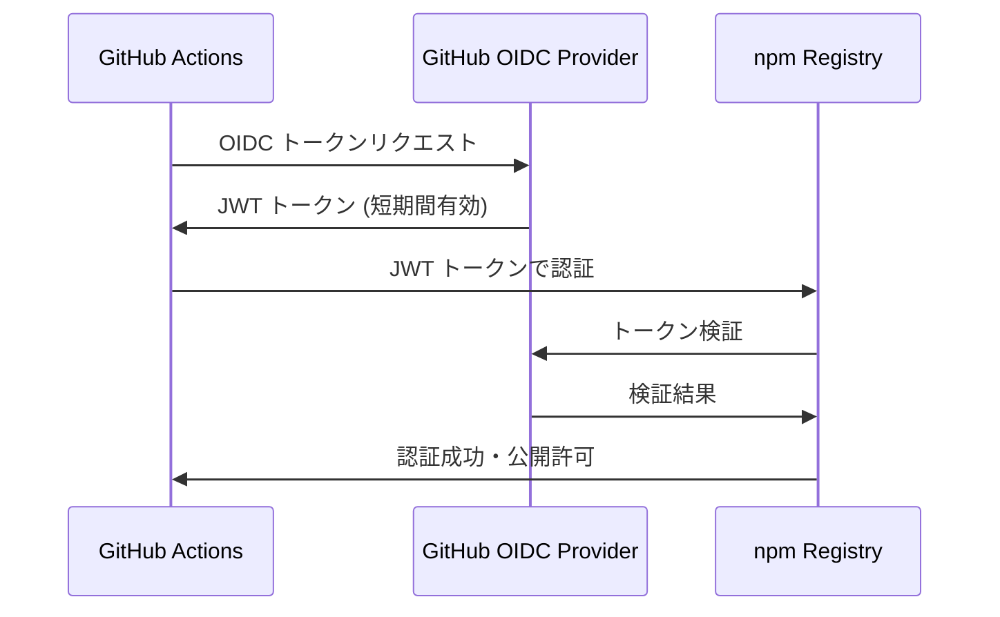

npm Trusted Publisher は、OpenID Connect (OIDC) を活用してnpmパッケージの公開をより安全に行うための仕組みです。この記事では、npm Trusted Publisher と OIDC の仕様について詳しく解説し、実装時のセキュリティ考慮事項について説明します。

## npm Trusted Publisher とは

npm Trusted Publisher は、従来のアクセストークン認証に代わる、より安全なパッケージ公開方法です。GitHub Actions などのCI/CD環境から、長期間有効なトークンを使わずにnpmパッケージを公開できます。

### 従来の問題点

従来のnpm publish には次のような課題がありました。

1. **長期間有効なアクセストークン**: npmトークンには明確な有効期限がない
2. **シークレット管理**: CI/CD環境でのトークン保存が必要
3. **権限スコープ**: トークンの権限制御が粗い
4. **監査ログ**: どのプロセスがパッケージを公開したかの追跡が困難

### Trusted Publisher の利点

- **短期間トークン** — OIDC トークンは短時間で自動的に期限切れ
- **シークレット不要** — 長期間のシークレットをCI/CDに保存する必要がない
- **細かい権限制御** — 特定のリポジトリ・ブランチからのみ公開可能
- **完全な監査ログ** — 公開元の環境とワークフローが記録される

## OIDC (OpenID Connect) の仕組み

### OIDC の基本フロー

OIDC は OAuth 2.0 の上に構築された認証プロトコルです。npm Trusted Publisher では次のようなフローで認証が行われます。



### OIDC トークンの構造

npm で使用される OIDC トークンには次のようなクレームが含まれます。

```json
{
  "iss": "https://token.actions.githubusercontent.com",
  "sub": "repo:owner/repository:ref:refs/heads/main",
  "aud": "npm",
  "repository": "owner/repository",
  "repository_owner": "owner",
  "ref": "refs/heads/main",
  "ref_type": "branch",
  "workflow": ".github/workflows/publish.yml",
  "job_workflow_ref": "owner/repository/.github/workflows/publish.yml@refs/heads/main",
  "iat": 1234567890,
  "exp": 1234567950
}
```

### 重要なクレーム

- **`sub` (Subject)** — リポジトリとブランチの一意識別子
- **`repository`** — パッケージを公開するリポジトリ
- **`ref`** — 公開元のブランチまたはタグ
- **`workflow`** — 実行されたワークフローファイル
- **`exp` (Expiration)** — トークンの有効期限（通常5-10分）

## npm での Trusted Publisher 設定

### 1. npm での設定

npm ウェブサイトでTrusted Publisherを設定します。

```bash
# npm CLI での設定確認
npm config list
npm whoami
```

npm ウェブサイトでの設定項目は次の通りです。

- **Provider** — GitHub Actions
- **Repository** — `owner/repository`
- **Environment** — (オプション) 環境名
- **Branch** — `main` または特定のブランチ
- **Workflow** — `.github/workflows/publish.yml`

### 2. GitHub Actions ワークフロー

```yaml
name: Publish to npm

on:
  release:
    types: [published]

jobs:
  publish:
    runs-on: ubuntu-latest
    permissions:
      id-token: write  # OIDC トークン取得に必要
      contents: read
    steps:
      - uses: actions/checkout@v4
      
      - name: Setup Node.js
        uses: actions/setup-node@v4
        with:
          node-version: '20'
          registry-url: 'https://registry.npmjs.org'
      
      - name: Install dependencies
        run: npm ci
      
      - name: Run tests
        run: npm test
      
      - name: Publish to npm
        run: npm publish --provenance --access public
        env:
          NODE_AUTH_TOKEN: ${{ secrets.NPM_TOKEN }}  # 不要になる
```

### 3. Trusted Publisher 対応版

```yaml
name: Publish to npm with Trusted Publisher

on:
  release:
    types: [published]

jobs:
  publish:
    runs-on: ubuntu-latest
    permissions:
      id-token: write  # OIDC トークン取得に必要
      contents: read
    steps:
      - uses: actions/checkout@v4
      
      - name: Setup Node.js
        uses: actions/setup-node@v4
        with:
          node-version: '20'
          registry-url: 'https://registry.npmjs.org'
      
      - name: Install dependencies
        run: npm ci
      
      - name: Run tests
        run: npm test
      
      # シークレット不要でnpm publish
      - name: Publish to npm
        run: npm publish --provenance --access public
```

## セキュリティ考慮事項

### 1. 権限制御の設計

```yaml
# 最小権限の原則
permissions:
  id-token: write    # OIDC トークン取得のみ
  contents: read     # コード読み取りのみ
  # その他の権限は付与しない
```

### 2. 環境制限

```yaml
# 本番環境のみでの公開
jobs:
  publish:
    environment: production  # 環境保護ルール適用
    runs-on: ubuntu-latest
```

### 3. ブランチ制限

npm 側で信頼できるブランチのみを設定します。

- `main` ブランチのみ
- `release/*` パターン
- 特定のタグパターン

### 4. ワークフロー制限

```yaml
# 特定のワークフローファイルのみ許可
workflow: .github/workflows/publish.yml
```

## 実装時のベストプラクティス

### 1. 段階的な移行

```bash
# 1. 既存のアクセストークンを維持しながらTrusted Publisherを設定
# 2. テスト環境での動作確認
# 3. 本番環境での切り替え
# 4. 既存トークンの無効化
```

### 2. 監査とモニタリング

```yaml
- name: Log publish attempt
  run: |
    echo "Publishing from:"
    echo "Repository: ${{ github.repository }}"
    echo "Ref: ${{ github.ref }}"
    echo "Workflow: ${{ github.workflow }}"
    echo "Actor: ${{ github.actor }}"
```

### 3. エラーハンドリング

```yaml
- name: Publish to npm
  run: npm publish --provenance --access public
  continue-on-error: false
  
- name: Notify on failure
  if: failure()
  run: |
    echo "Failed to publish package"
    # Slack/メール通知など
```

## トラブルシューティング

### よくある問題

1. **OIDC トークン取得エラー**
   ```yaml
   permissions:
     id-token: write  # この設定が必要
   ```

2. **リポジトリ/ブランチの不一致**
   - npm 設定とワークフロー実行環境の確認

3. **ワークフローファイルのパス相違**
   - 正確なファイルパスの指定が必要

### デバッグ方法

```yaml
- name: Debug OIDC token
  run: |
    echo "GitHub context:"
    echo "Repository: ${{ github.repository }}"
    echo "Ref: ${{ github.ref }}"
    echo "Workflow: ${{ github.workflow }}"
```

## 他のCI/CDプラットフォームとの比較

### GitHub Actions
- **完全対応**
- **豊富な設定オプション**

### GitLab CI
- **部分的対応**（実装中）
- 設定項目が制限される可能性があります

### CircleCI
- **未対応**（2025年9月時点）
- 将来的な対応が予定されています

## まとめ

npm Trusted Publisher と OIDC の組み合わせにより、次のような利点が得られます。

1. **セキュリティ向上**: 長期間トークンの排除
2. **運用簡素化**: シークレット管理の削減
3. **監査強化**: 詳細な公開元情報の記録
4. **権限制御**: 細かい公開権限の制御

### 移行のステップ

1. npm アカウントでTrusted Publisher設定
2. GitHub Actions ワークフローの更新
3. テスト環境での動作確認
4. 段階的な本番適用
5. 既存トークンの無効化

現在のnpm エコシステムにおいて、Trusted Publisher は推奨されるセキュリティ実装となっており、新規プロジェクトでは最初から導入を検討することを強く推奨します。

## 参考リンク

- [npm Trusted Publisher Documentation](https://docs.npmjs.com/trusted-publisher)
- [GitHub OIDC Documentation](https://docs.github.com/en/actions/deployment/security-hardening-your-deployments/about-security-hardening-with-openid-connect)
- [OpenID Connect Specification](https://openid.net/connect/)
- [npm Provenance Documentation](https://docs.npmjs.com/generating-provenance-statements)
